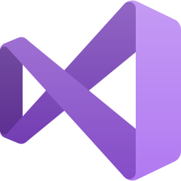

# Evergine XRV add-on


XRV is a library we use internally while developing custom XR experiences for our customers. It aims to gather in one place various functionalities and features commonly required by the applications we build, such as floating windows, hand menus, voice commands, and more.

It is based on our own [MRTK add-on](https://github.com/EvergineTeam/MixedRealityToolkit), which means it uses the same input pointers, user controls like buttons or sliders, configuration components, etc. Leveraging this foundation, we have built the entire XRV infrastructure.

Most of the features are supported on many platforms, but some features may not be available on all platforms. You can run XRV on devices like:

- Meta Quest 1
- Meta Quest 2
- Meta Quest 3
- Meta Quest Pro
- Pico XR headsets

---
**Note:**
Microsoft HoloLens 2 is out-of-support.

---

## Builds

|Branch|Status|
|:--:|:--:|
|main|[](https://github.com/EvergineTeam/XRV/tree/main)|
|develop|[](https://github.com/EvergineTeam/XRV/tree/develop)|

## Documentation

https://docs.evergine.com/2024.10.24/manual/addons/xrv/index.html

## Required software

| <a href="https://www.evergine.com"></a><br/> [Evergine](https://www.evergine.com) | <a href="http://dev.windows.com/downloads"></a><br/> [Visual Studio 2019/2022](http://dev.windows.com/downloads) |
|----------------------------------------------------------------------------------------------------------------------------------------------------|----------------------------------------------------------------------------------------------------------------------------------------------------------------|
| Evergine provides support for building XR projects in Windows 10                                                                                     | Visual Studio is used for code editing, deploying, and building application packages                                                                            |

## How to update to newer Engine version

1. Ensure MRTK is updated to new Evergine version.
2. Update Engine references in XRV. You can use Evergine Launcher for this (it will automatically update all references).
3. Update packages targets in _Directory.Build.props_ file.
```
	<ItemGroup Condition="'$(IsAddOnProject)'=='true'">
		<PackageReference Include="Evergine.Packages.Targets" Version="2023.9.21.1-nightly" />
	</ItemGroup>
```
4. **(If you want to create XRV public packages)** Remember to update _Directory.Build.props_ file to point to public MRTK version to be used.
```
    <ItemGroup Condition="'$(UseMRTKNuget)'=='true' And '$(ReferenceMRTK)'=='true'">
		<PackageReference Include="Evergine.MRTK" Version="2023.9.25.3-nightly" />
    </ItemGroup>
```

---
Powered by [Evergine](https://evergine.com)

LET'S CONNECT!

- [Youtube](https://www.youtube.com/c/Evergine)
- [Twitter](https://x.com/EvergineTeam)
- [Blog](https://evergine.com/news/)
